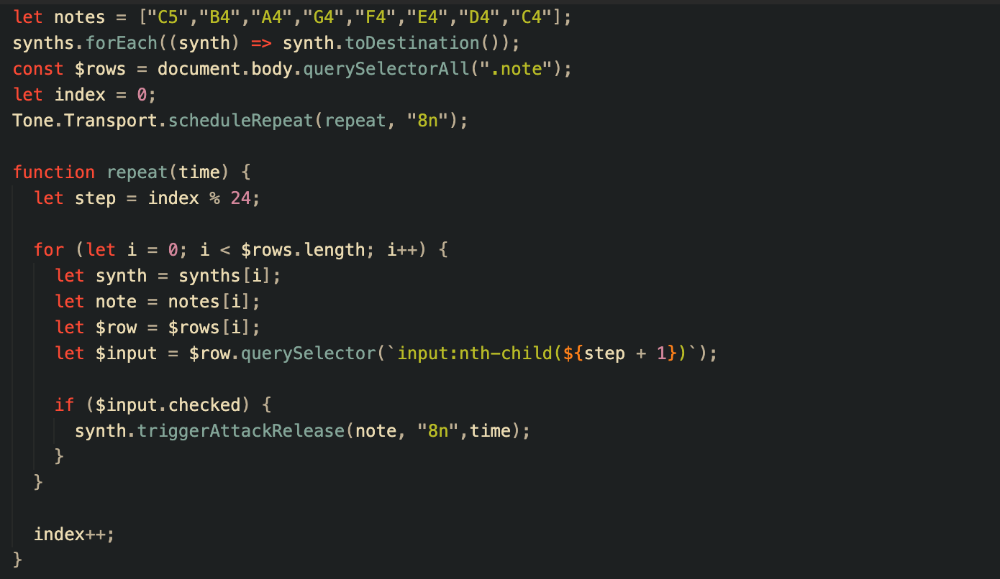
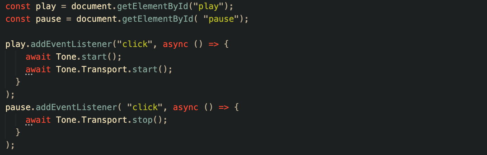

# illogic

## 1. Background and Overview
      A visually-stimulating, interactive musical environment. This project will showcase a combination of my previous and current passions

## 2. Functionality & MVP's
      Users will be able to interact with the app and receive tonal feedback.
      Choose different instruments
      Manipulate the shape of the sound

## 3. Wireframes

## 4. Technologies
      Tone.js
      Web Audio API
      JavaScript
      CSS
      HTML
      

      
## 5. MVP List
      1: File Skeleton/ Data Structure

      2: Tonal Components

      Synths are linked to an array of notes and are triggered based on the "selected" attribute.

      3: Playback Functionality

      Play and pause are triggered using asynchronous functions.

      4: Plugin Components (soundwave modifier)

      5: Styling and Cleanup
      
      * Future Implementations:
          Different Instruments
          
      

