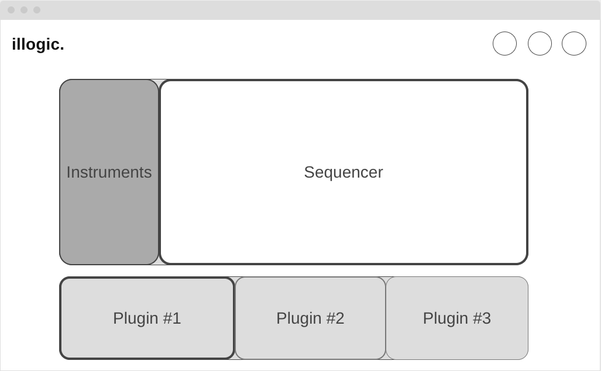

# music-synth / DAW 
(name tbd)(digital audio workstation)

* [QUESTION TO COACHES]: How realistic is it to create one of these in one week? https://tonejs.github.io/demos
      * Is it more realistic to create a basic instrument or is something like this possible?

## 1. Background and Overview
      * A visually-stimulating, interactive musical environment. This project will showcase a combination of my previous and current passions

## 2. Functionality & MVP's
      * Users will be able to interact with the app and receive tonal feedback.
      * Choose different instruments
      * Manipulate the shape of the sound

## 3. Wireframes

## 4. Technologies
      * Tone.js
      * Javascript
      
## 5.
      * Day 1: File Skeleton/ Data Structure
      * Day 2: Tonal Components
      * Day 3: Different Instruments (Variations of Tonals)
      * Day 4: Plugin Components (soundwave modifier)
      * Day 5: Styling and Cleanup
      

